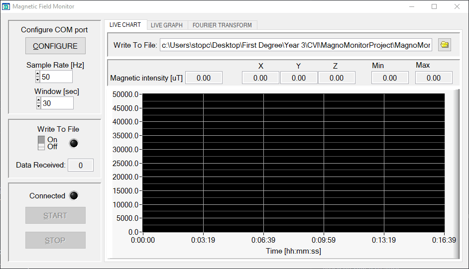

# MagnoMonitor

MagnoMonitor is a program designed to monitor and analyze magnetic fields in real time, using data from a transmitter device that measures magnetic fields in three orthogonal axes (x, y, and z).

## Features

- Real-time monitoring and processing of magnetic field data
- COM port communication for data input
- Configurable connection settings
- Live chart visualization
- 3D graph representation
- Fourier transform analysis
- Data logging functionality
- User-friendly interface with multiple views

## Requirements

- LabWindows/CVI
- RS-232 compatible device 

## Usage

1. Click "CONFIGURE" to set up communication parameters.
2. (Optional) Enable data logging by toggling "Write to File".
3. Set the sample rate and time window for the strip chart.
4. Click "START" to begin data acquisition and processing.
5. Use tabs to switch between live chart, 3D graph, and Fourier transform views.
6. Click "STOP" to end data acquisition.
7. In the Fourier transform tab, click "PLOT FFT" to calculate and display the Fourier transform.

## Configuration

Use the RS-232 Configurator to set:
- COM port
- Baud rate
- Parity
- Data bits
- Stop bits
- Handshaking mode
